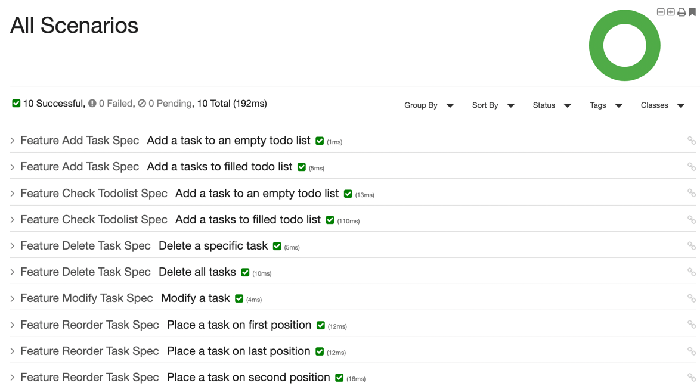

# Software craftsmanship & Affordance 

Firstly, objective of this sandbox is to practice **behaviour driven development**, **domain driven design**, **test driven development**.

Then, we can see today the trend to split front and back-end. These implementations often create a **duplication of business rules**.  
Indeed, in front we see conditions on the entities to allow such or such action. What about find a way to maximize business rules in the domain (back-end) ?    
**REST** permits exposing resources, linked actions and everything we want (if it makes sense with this resource). And more precisely when we implement **HATEOAS** constraint (_Hypermedia As The Engine of Application State_).  
Thanks to that, we could reduce back and front office coupling.  
We therefore speak of affordance, and I will try to implement it.

Few words about [affordance and choices](../doc/affordance.md).

## Steps

- [x] Describe business rules with gherkins
- [x] Initialize project and install needed tools
- [x] Implement business rules (domain, behaviour driven development)
- [x] Install Hateoas tool & configure it
- [x] First steps with affordance, expose a resource
- [x] [Implement Domain driven design](../doc/ddd.md)
- [x] [Implement Event sourcing](../doc/event_sourcing.md)
- [x] Write tests which describe consumer attendees
- [ ] Add more complex business rules
- [ ] Add a database
- [ ] Develop a front-end to demonstrate the principle

# First steps

We will start this BDD training with a basic todo list application.

First of all, I write the hearth of my application, uses cases, business rules.
This part (domain) has to be well tested, it carries the intelligence of my application.

I like the approach provide by [jgiven](https://jgiven.org/). I use this library to declare my gerkhins & generate reports (json & html).
After writing it, I develop my functionalities, TDD approach.

## Features

1. Check todo list tasks
2. Add a task in my todo list
3. Delete a task from my todo list
4. Modify a task from my todo list
5. Move a task from my todo list

[Associated gherkins](../doc/gherkins.md)

## Installation

### Nix

[Nix installation documentation](doc/nix.md).

### Without Nix

Prerequisites : [`Maven`](https://maven.apache.org/install.html) & [`Jdk18`](https://www.oracle.com/java/technologies/javase/jdk18-archive-downloads.html) 

### Project

```bash
mvn install
mvn test
```

## Generate HTML reports

```bash
mvn verify
```

HTML reports are then generated into the target`/jgiven-reports/html` directory. Note that the plugin relies on the existence of the JSON output, so if the property jgiven.reports.enabled was set to false, no output will be generated.



## Project Initialization

After some problems with a homemade version, I was inspired by [Spring hateoas examples](https://github.com/spring-projects/spring-hateoas-examples) and more precisely [affordances part](https://github.com/spring-projects/spring-hateoas-examples/tree/main/affordances) which show how to create templates.  

Templates allow to return the way you can create, modify or delete the given resource.  
More information about it in [Affordance documentation](../doc/affordance.md);

## Ideas

- Create a limit, max 10 tasks in my todolist
- Authenticate a user and affect him some todolist
